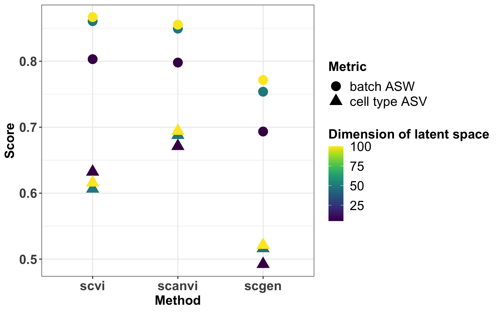
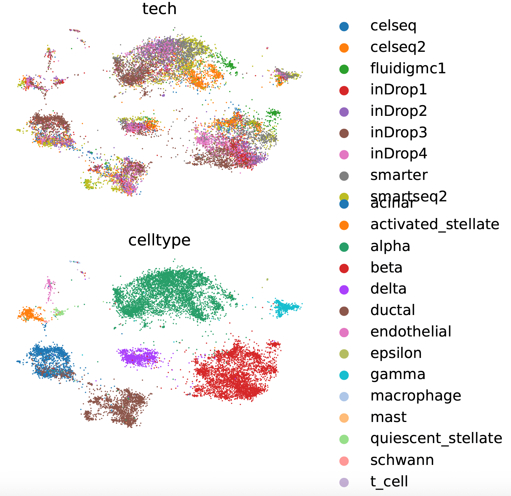
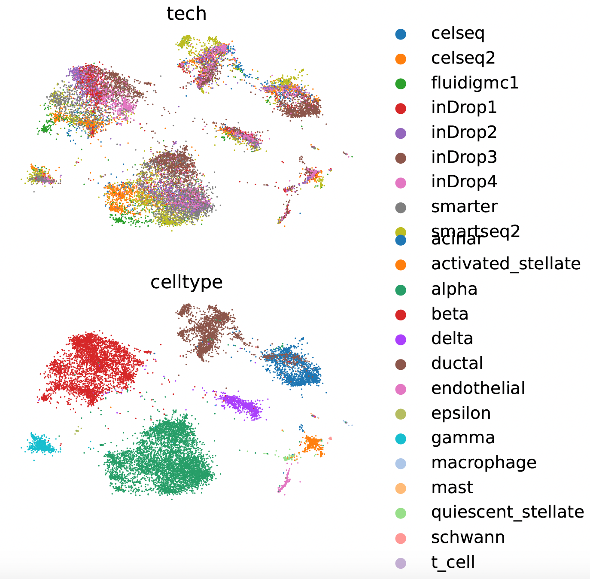
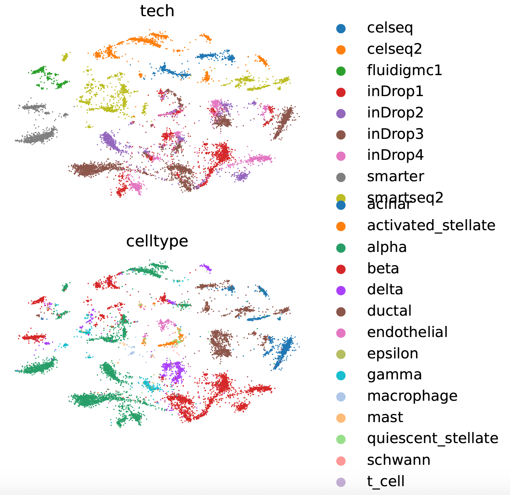

class: middle, left, my_title
$\def\trans{^{\text{T}}}$
$\def\tr{\text{tr}}$
$\def\vect{\text{vec}}$

```{r, echo = FALSE, message = FALSE, warning = FALSE}
library(knitr)
library(tidyverse)
library(RefManageR)
opts_chunk$set(echo = FALSE, message = FALSE, warning = FALSE, cache = T, dpi = 200, fig.align = "center", fig.width = 6, fig.height = 3)
BibOptions(
  check.entries = FALSE, 
  bib.style = "authoryear", 
  cite.style = "authortitle",
  style = "markdown",
  hyperlink = FALSE, 
  dashed = FALSE
)
bib <- ReadBib( "ref.bib")
```


## Benchmarking single cell RNA sequencing integration


.pull[


Xinran Miao

05/02/2022

]


---
# Background

* **Dataset**: Single-cell RNA sequencing (scRNA-seq) datasets.
    * each dataset consists of a `cell` by `gene` expression matrix, where cells are annotated with batches and labels.
* **Goal**: Combining high-throughput sequencing datasets to produce a self-consistent version of the data for downstream analysis.

* **Reason**: Integrating scRNA-seq helps biological findings.


* **Challenges**: 
   * Dealing with noise, sparsity, batch effects and rare cell types.
   * Evaluating integration methods.

---
# Background


.pull-left[
* `r Citep(bib, c("luecken2022benchmarking"))` benchmarked 68 methods in 13 integration tasks.
* They used 14 metrics to evaluate integration methods on their ability to
   * **remove batch effects**, and
   * **conserve biological variations**.
* They provided guidelines to choose an integration method given a task.
* For all methods, they used default parameters.
]

.pull-right[


```{r, out.width = 400}

```
]
---

# Methods

* Integrating scRNA-seq datasets usually include two parts:
    * jointly **embedding** high-dimensional input onto a shared latent space, and
    * (soft) **clustering** cells that incorporates annotated information (e.g. cell type).

* In this presentation, we aim to study the dependence of integration methods on the dimension of latent space.
* We focus on three methods that build deep generative models: 
    * `scVI``r Citep(bib, c("lopez2018deep"))`,
    * `scGen` `r Citep(bib, c("lotfollahi2019scgen"))`, and
    * `scANVI``r Citep(bib, c("xu2021probabilistic"))`.


---

# Evaluation
* Average silhoutte width (ASW) measures the separation of clusters.
* We use modified **batch ASW** and **cell type ASW** to evaluate the ability of batch removal and biogical conservation, respectively.
* For both, the larger ASW we have, the better.
---

# Real-data analysis: human immune cell integration
* Task: integrating 5 datasets of 10 batches (donors) with cells from peripheral blood and bone marrow, annotated by cell types
* According to `r Citep(bib, c("luecken2022benchmarking"))`, `scANVI` is one of the best methods, evaluated by a weighted mean of 14 metrics.
---
# Results

.pull-left[
* We vary the dimension of latent space, and evaluate `scvi`, `scanvi` and `scgen` using batch ASW and cell type ASW.
* Overall, `scgen` works worst.
* For `scvi` and `scanvi`, there is a trade-off between removing batch effects and conserving biological variations.
   * High-dimensional latent space leads to better batch removal and worse biological conservation.
   * The choice of latent space dimension doesn't affect the rank across methods.
]

.pull-right[

```{r, out.width = 600}

```
]


---
# Results

Latent space fitted by `scvi` projected onto 2d space, with dimension of latent space (left) 5 and (right) 100, colored by (top) batches and (bottom) cell types. 

.pull-left[

```{r, out.width = 400}

```
]

.pull-right[

```{r, out.width = 400}

```
]
---

# Results

Latent space fitted by (left) `scanvi` and `scgen` projected onto 2d space, , colored by (top) batches and (bottom) cell types. 

.pull-left[

```{r, out.width = 400}

```
]

.pull-right[

```{r, out.width = 400}

```
]
---
# Takeaways

* For each method, the performance of integration methods is dependent on the dimension of latent space.
    * High-dimensional latent space leads to better batch removal and worse biological conservation.
    * That being said, it's hard to tell the difference in visualizations on 2d space.
* The choice of latent space dimension doesn't affect the rank across methods.
---

class: middle, left, my_end


# Thank You! <br> Questions?

---
### References
```{r, results = "asis"}
PrintBibliography(bib)
```